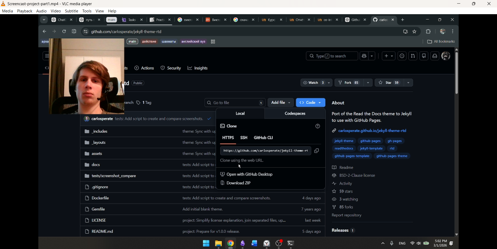
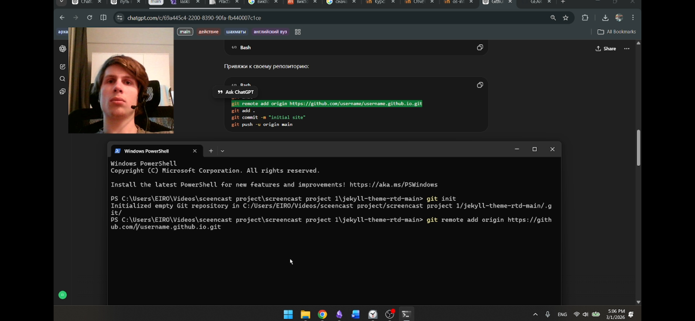
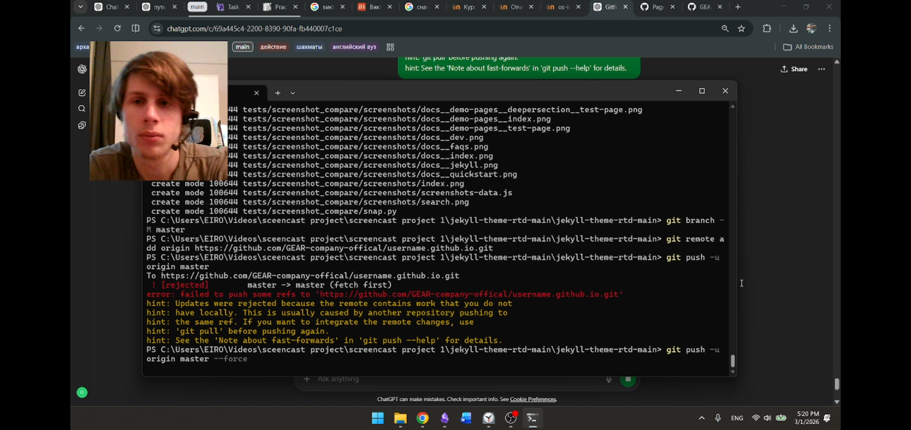
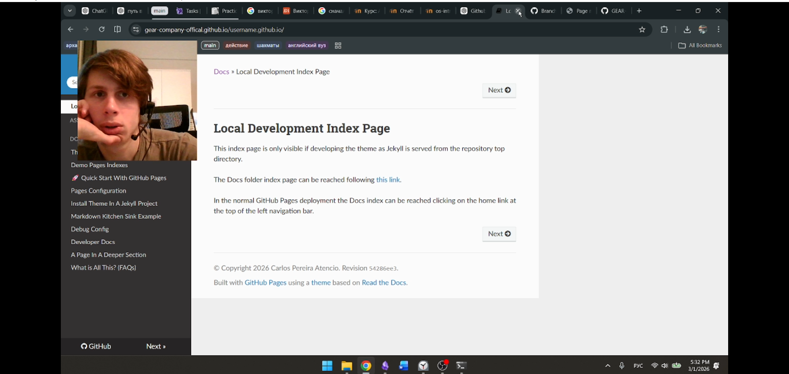

<style>
section.img {
  display: flex;
  justify-content: center;
  align-items: center;
  text-align: center;
}

section.img img {
  display: block;
  margin: auto;
  max-width: 90%;
  max-height: 90%;
}
</style>
# Размещение заготовки персонального сайта  
## на GitHub Pages

Лабораторная работа  

---

# Цель работы

Разместить заготовку персонального сайта  
на платформе GitHub Pages.

---

# Используемое программное обеспечение

- Git — система контроля версий  
- Visual Studio Code — редактор кода  
- Веб-браузер — проверка отображения  
- GitHub — хостинг репозитория  

---

# Шаг 1. Установка Git

Проверка установки:

```bash
git --version
```

---

<!-- _class: img -->


---

# Шаг 2. Скачивание шаблона

### Через Git
```bash
git clone https://github.com/username/theme-name.git
```

### Через ZIP-архив
- Скачать архив  
- Распаковать в рабочую папку  

---

<!-- _class: img -->


---

# Шаг 3. Создание репозитория

Формат репозитория:

```
username.github.io
```

---

<!-- _class: img -->


---

# Инициализация Git

```bash
git init
git add .
git commit -m "Initial commit"
```

---

<!-- _class: img -->


---

# Подключение удалённого репозитория

```bash
git remote add origin https://github.com/username/username.github.io.git
git push -u origin master
```

---

<!-- _class: img -->


---

# Шаг 4. Настройка URL

В конфигурационном файле `_config.yml`:

```yml
url: "https://username.github.io"
baseurl: ""
```

Это необходимо для корректной работы внутренних ссылок.

---

# Шаг 5. Публикация сайта

Settings → Pages  
Выбрать ветку master  

---

<!-- _class: img -->


---

# Результат

Сайт стал доступен по адресу:

```
https://username.github.io
```

---

<!-- _class: img -->


---

# Вывод

- Освоен процесс публикации сайта  
- Настроен репозиторий GitHub  
- Размещена заготовка сайта  
- Проверена корректность отображения  

GitHub Pages позволяет бесплатно размещать статические сайты  
без необходимости настройки сервера.

---

# Спасибо за внимание